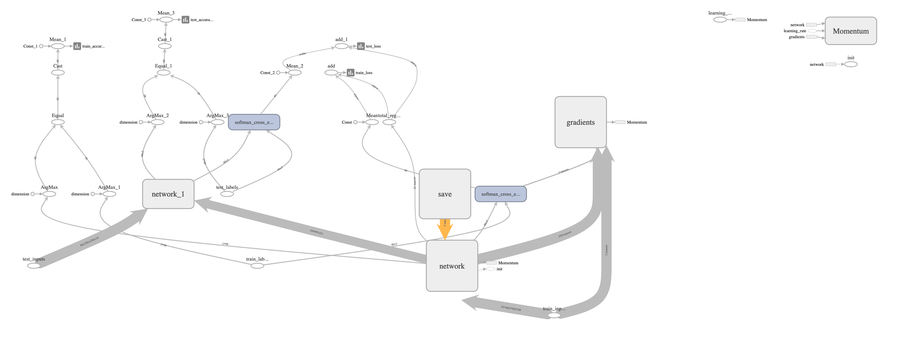

# Cardiovascular risk computed via Deep Learning (DL) on thoracic CT scans (Med3DResNet)

### Timothy Burt, Luben Popov, Yuan Zi
#### COSC 7373 Adv. Computer Vision F19 Team 1

## Project Goal
+ Design, build, train, and test a deep learning pipeline for feature detection using thoracic CT scans of patients’ hearts
  + Obtain thoracic CT scans of patients
  + Design and implement an annotation tool to annotate crop landmarks for the CT scans
  + Implement a normalization pipeline to normalize the CT scans into 3D arrays
  + Design and implement a CNN that performs feature selection on the normalized arrays
 
### Project Pipeline

### Annotation GUI

### Data preprocessing / normalization
1. Loading the DICOM files
2. Converting the pixel values to Hounsfield Units (HU) 
3. Heart segmentation   
3. Normalization that makes sense.
4. Zero centering the scans.

Dicom is the de-facto file standard in medical imaging(CT,FMRI,etc). These files contain a lot of metadata (such as the pixel size, so how long one pixel is in every dimension in the real world).

This pixel size/coarseness of the scan differs from scan to scan (e.g. the distance between slices may differ), which can hurt performance of CNN approaches. We can deal with this by isomorphic resampling, which we will do later.

Below is code to load a scan, which consists of multiple slices, which we simply save in a Python list. Every folder in the dataset is one scan (so one patient). One metadata field is missing, the pixel size in the Z direction, which is the slice thickness. Fortunately we can infer this, and we add this to the metadata.

#### Load the scans in given folder path
     def load_scan(path):
        slices = [dicom.read_file(path + '/' + s) for s in os.listdir(path)]
        slices.sort(key = lambda x: float(x.ImagePositionPatient[2]))
        try:
            slice_thickness = np.abs(slices[0].ImagePositionPatient[2] - slices[1].ImagePositionPatient[2])
        except:
            slice_thickness = np.abs(slices[0].SliceLocation - slices[1].SliceLocation)
            
        for s in slices:
            s.SliceThickness = slice_thickness
            
        return slices   
Change load path point to the folder contains patients' DICOM file and load data volume.

####Converting the pixel values to Hounsfield Units (HU) 

The unit of measurement in CT scans is the Hounsfield Unit (HU), which is a measure of radiodensity. CT scanners are carefully calibrated to accurately measure this. From Wikipedia:

Some scanners have cylindrical scanning bounds, but the output image is square. The pixels that fall outside of these bounds get the fixed value -2000. The first step is setting these values to 0, which currently corresponds to air. Next, let's go back to HU units, by multiplying with the rescale slope and adding the intercept (which are conveniently stored in the metadata of the scans!).

    def get_pixels_hu(slices):
        image = np.stack([s.pixel_array for s in slices])
        # Convert to int16 (from sometimes int16), 
        # should be possible as values should always be low enough (<32k)
        image = image.astype(np.int16)
    
        # Set outside-of-scan pixels to 0
        # The intercept is usually -1024, so air is approximately 0
        image[image == -2000] = 0
        
        # Convert to Hounsfield units (HU)
        for slice_number in range(len(slices)):
            
            intercept = slices[slice_number].RescaleIntercept
            slope = slices[slice_number].RescaleSlope
            
            if slope != 1:
                image[slice_number] = slope * image[slice_number].astype(np.float64)
                image[slice_number] = image[slice_number].astype(np.int16)
                
            image[slice_number] += np.int16(intercept)
        
        return np.array(image, dtype=np.int16)
Let's take a look at one of the patients.

####Heart segmentation(Method 1)
1.extract crop points coordinate from jason file.

    def read_crop_points(file_path):
        crop_points=[]
        with open(file_path) as json_file:
    		data = json.load(json_file)
    		num_superior_slice=data['slices']
    		for p in data['slices']:
    			crop_points.append(p['bounds'])
    			print('file_name'+ p['file_name'])
    			print('crop_points: ' + str(p['bounds']))
    			#print('num_slices: ' + p['num_slices'])
    			print('')
    		num_inferior_slice = p
    	return crop_points, num_superior_slice, num_inferior_slice

2.creat mask with annotation file(each slices 4 points) and crop images.
3.Delete out of selected region vulume part.
    def make_mask(crop_points,img, display=False):
        row_size = img.shape[0]
    	col_size = img.shape[1]
    	# Create a Polygon
    
    	coords = crop_points
    	polygon = Polygon(coords)
    	mask = np.ndarray([row_size, col_size], dtype=np.int8)
    	mask[:] = 0
    	for i in range(row_size):
    		for j in range(col_size):
    			mask[i,j]=polygon.contains(Point(i, j))
    	# show image before and after mask
    	if (display):
    		fig, ax = plt.subplots(3, 2, figsize=[12, 12])
    		ax[0, 0].set_title("Original")
    		ax[0, 0].imshow(img, cmap='gray')
    		ax[0, 0].axis('off')
    		ax[0, 1].set_title("mask")
    		ax[0, 1].imshow(mask, cmap='gray')
    		ax[0, 1].axis('off')
    		ax[1, 0].set_title("after crop")
    		ax[1, 0].imshow(mask * img, cmap='gray')
    		ax[1, 0].axis('off')
    		plt.show()
    	return mask * img
####Resampling
A scan may have a pixel spacing of [2.5, 0.5, 0.5], which means that the distance between slices is 2.5 millimeters. For a different scan this may be [1.5, 0.725, 0.725], this can be problematic for automatic analysis (e.g. using ConvNets)!

A common method of dealing with this is resampling the full dataset to a certain isotropic resolution. If we choose to resample everything to 1mm1mm1mm pixels we can use 3D convnets without worrying about learning zoom/slice thickness invariance.

Whilst this may seem like a very simple step, it has quite some edge cases due to rounding. Also, it takes quite a while.

Below code worked well for us (and deals with the edge cases):

    def resample(image, scan, new_spacing=[1,1,1]):
        # Determine current pixel spacing
        spacing = np.array([scan[0].SliceThickness] + scan[0].PixelSpacing, dtype=np.float32)
    
        resize_factor = spacing / new_spacing
        new_real_shape = image.shape * resize_factor
        new_shape = np.round(new_real_shape)
        real_resize_factor = new_shape / image.shape
        new_spacing = spacing / real_resize_factor
        
        image = scipy.ndimage.interpolation.zoom(image, real_resize_factor, mode='nearest')
        
        return image, new_spacing
Please note that when you apply this, to save the new spacing! Due to rounding this may be slightly off from the desired spacing (above script picks the best possible spacing with rounding).

Let's resample our patient's pixels to an isomorphic resolution of 1 by 1 by 1 mm.

    print("Shape before resampling\t", imgs_to_process.shape)
    imgs_after_resamp, spacing = resample(imgs_to_process, patient, [1, 1, 1])
    print("Shape after resampling\t", imgs_after_resamp.shape)
    Shape before resampling     (133, 512, 512)
    Shape after resampling     (332, 360, 360)
    
####3D plotting the scan
For visualization it is useful to be able to show a 3D image.So we will use marching cubes to create an approximate mesh for our 3D object, and plot this with matplotlib. 
    
    def plot_3d(image, threshold=-300):
        
        # Position the scan upright, 
        # so the head of the patient would be at the top facing the camera
        p = image.transpose(2,1,0)
        
        verts, faces = measure.marching_cubes(p, threshold)
    
        fig = plt.figure(figsize=(10, 10))
        ax = fig.add_subplot(111, projection='3d')
    
        # Fancy indexing: `verts[faces]` to generate a collection of triangles
        mesh = Poly3DCollection(verts[faces], alpha=0.70)
        face_color = [0.45, 0.45, 0.75]
        mesh.set_facecolor(face_color)
        ax.add_collection3d(mesh)
    
        ax.set_xlim(0, p.shape[0])
        ax.set_ylim(0, p.shape[1])
        ax.set_zlim(0, p.shape[2])
    
        plt.show()
Our plot function takes a threshold argument which we can use to plot certain structures, such as all tissue or only the bones. 400 is a good threshold for showing the bones only (see Hounsfield unit table above). Let's do this!

    plot_3d(pix_resampled, 400)

####Heart segmentation(Method 2)
In order to reduce the problem space, we can segment the heart.

Machine learning algorithms work a lot better when you can narrowly define what it is looking at. One way to do this is by creating different models for different parts of a chest CT. For instance, a convolutional network for hearts would perform better than a general-purpose network for the whole chest.

Therefore, it is often useful to pre-process the image data by auto-detecting the boundaries surrounding a volume of interest.

The below code will:

Standardize the pixel value by subtracting the mean and dividing by the standard deviation
Identify the proper threshold by creating 2 KMeans clusters comparing centered on soft tissue/bone vs lung/air.
Using Erosion) and Dilation) which has the net effect of removing tiny features like pulmonary vessels or noise
Identify each distinct region as separate image labels (think the magic wand in Photoshop)
Using bounding boxes for each image label to identify which ones represent heart and which ones represent "every thing else"
Create the masks for heart fields.
Apply mask onto the original image to erase voxels outside of the lung fields.

But there's one thing we can fix, it is probably a good idea to include structures within the heart.

Anyway, when you want to use this mask, remember to first apply a dilation morphological operation on it (i.e. with a circular kernel). This expands the mask in all directions. The air + structures in the lung alone will not contain all nodules, in particular it will miss those that are stuck to the side of the lung, where they often appear! So expand the mask a little :)

This segmentation may fail for some edge cases. It relies on the fact that the air outside the patient is not connected to the air in the lungs. If the patient has a tracheostomy, this will not be the case, I do not know whether this is present in the dataset. Also, particulary noisy images (for instance due to a pacemaker in the image below) this method may also fail. Instead, the second largest air pocket in the body will be segmented. You can recognize this by checking the fraction of image that the mask corresponds to, which will be very small for this case. You can then first apply a morphological closing operation with a kernel a few mm in size to close these holes, after which it should work (or more simply, do not use the mask for this image).

pacemaker example

####Normalization
Our values currently range from -1024 to around 2000. Anything above 400 is not interesting to us, as these are simply bones with different radiodensity. A commonly used set of thresholds in the LUNA16 competition to normalize between are -1000 and 400. Here's some code you can use:

MIN_BOUND = -1000.0
MAX_BOUND = 400.0
    
    def normalize(image):
        image = (image - MIN_BOUND) / (MAX_BOUND - MIN_BOUND)
        image[image>1] = 1.
        image[image<0] = 0.
        return image
####Zero centering
As a final preprocessing step, it is advisory to zero center your data so that your mean value is 0. To do this you simply subtract the mean pixel value from all pixels.

To determine this mean you simply average all images in the whole dataset. If that sounds like a lot of work, we found this to be around 0.25 in the LUNA16 competition.

Warning: Do not zero center with the mean per image (like is done in some kernels on here). The CT scanners are calibrated to return accurate HU measurements. There is no such thing as an image with lower contrast or brightness like in normal pictures.

PIXEL_MEAN = 0.25

    def zero_center(image):
        image = image - PIXEL_MEAN
        return image

With these steps your images are ready for consumption by your CNN or other ML method :). You can do all these steps offline (one time and save the result), and I would advise you to do so and let it run overnight as it may take a long time.

Tip: To save storage space, don't do normalization and zero centering beforehand, but do this online (during training, just after loading). If you don't do this yet, your image are int16's, which are smaller than float32s and easier to compress as well.

If this tutorial helped you at all, please upvote it and leave a comment :)

### Correlation between heart and lung disease

Lipid-rich plaque: 47+-29 HU (range 18-76)
Fibrous (calcified) plaque: 86+-29 HU (range 57-115)
CT's with or without lumen-enhancing contrast show no statistical significance on these values.
(A Meta Analysis and Hierarchical Classification of HU-Based Atherosclerotic Plaque Characterization Criteria)

### 3D CNN: Ontology and ‘ResNets’
We employ an architecture similar to that of [S. Trajanovski et al., “Towards radiologist-level cancer risk assessment in CT lung screening using deep learning,” pp. 1–11, 2018.].

The original paper on ResNets can be found here [He, X. Zhang, S. Ren, and J. Sun, “Deep Residual Learning for Image Recognition,” in 2016 IEEE Conference on Computer Vision and Pattern Recognition (CVPR), 2016, vol. 2016-Decem, pp. 770–778].
 
While the source code was based on a [ResNet-TensorFlow implementation on GitHub](https://github.com/taki0112/ResNet-Tensorflow), it has been extensively
modified to work with 3D medical scans. Specifically our input size is 256X256X256 pixels, with a 16-bit integer intensity in Hounsfield Units.

Our Med3DResNet leaves the X and Y image dimensions alone for each slice, but averaging is performed in the z-direction to compress unneeded data.
The code currently allows for 4, 8, and 16 slice axial-averages and this information is then fed into the number of channels for each input image (64, 32, and 16 channels, respectively).

Network architecture graphs for 3 of our selected models are shown below, generated using TensorBoard.

ResNet 18-layer wide, residual blocks [2, 2, 2, 2]. 16 z-slice averaged (16 CH).

ResNet 34-layer super-wide, residual blocks [3, 4, 6, 3]. 8 z-slice averaged (32 CH).

ResNet 101-layer ultra-wide, residual blocks [3, 4, 23, 3]. 4 z-slice averaged (64 CH).

add plots of what 3 z-slice averaging types looks like

#### [LIDC-IDRI Dataset](https://wiki.cancerimagingarchive.net/display/Public/LIDC-IDRI)
* 1,017 thoracic CT scans
* Subset of 157 patients have diagnosis data, all annotated with our tool
* 4 classes: 
1) Unknown
2) benign or non-malignant disease
3) malignant, primary lung cancer
4) malignant metastatic (spread beyond the lungs)

The unknown class could not be used because a confirmation is not provided, even though a diagnosis is. So the stage of the disease is unknown.

Therefore, 3 latent classes are used from the diagnostic truth containing 130 annotated CT scans. Below is a table with our train/test validation method.

#### Train/validation method

To eliminate bias and obtain the best test accuracy with our limited dataset, 70/30 and 80/20 train/test split .csv files are provided, 
and either may be called using a flag in our tool. Each class is split evenly be hand to ensure an equal split for each class.
Random shuffling is performed within each group as well during every epoch.

|                                  | Train | Test | Train | Test | Total Annotated Data |
|----------------------------------|-------|------|-------|------|----------------------|
|                                  | 0.7   | 0.3  | 0.8   | 0.2  |                      |
| Benign                           | 25    | 11   | 28    | 8    | 36                   |
| Malignant, primary lung cancer   | 30    | 13   | 34    | 9    | 43                   |
| Malignant metastatic (spreading) | 35    | 16   | 40    | 11   | 51                   |
| Total                            | 90    | 40   | 102   | 28   | 130                  |

#### 3D CNN tutorial
To start the training/testing process, it is assumed you have already annotated the relevant patients and batch exported the affine/projection images.

CNN_main.py is the entry point for training/validation of our Med3DResNet. There are a number of flags which must be provided 
at runtime which contain the model specifications, given in the table below.

|       Flag       |     Type    |                                                                                                                                Definition                                                                                                                               |
|:----------------:|:-----------:|:-----------------------------------------------------------------------------------------------------------------------------------------------------------------------------------------------------------------------------------------------------------------------:|
|       phase      |     str     |                                                                              Train or test. Train will do initial training, and test will give a final accuracy f-score loading the model.                                                                              |
|       epoch      |     int     |                                                                                                                 Number of epochs to run. 25 works well.                                                                                                                 |
|    batch size    |     int     | Size of each minibatch for each epoch. Must be less than total train/test data samples. (e.g. with 100 data samples, if batch_size is 50 and total data size is 100 each epoch will split the data randomly with 2 separate train/test accuracies output to the screen. |
|       res_n      |     int     |                                                                  Number of residual layers for model. '18, 34, 50, 101, 152' may all be called, each doubling in memory requirements as they increase.                                                                  |
|        lr        |    float    |                                                                         Learning rate. This is an adaptive hyperparameter, starting at 0.1 by default and slows to 0.001 by the end of training.                                                                        |
|   use_lung_mask  | action_bool |                                                               If flag provided, the model will read masked images of the specified type which remove the lungs (only works with affine correctly for now)                                                               |
|     data_type    |     str     |                                                                                              Either `affine` or `projection` generated images can be used to train the CNN                                                                                              |
| n_axial_channels |     int     |                                                                     Compression of z-direction axial slice thickness [256 -> 16,8,4]. This also determines the input image channels [1 -> 16,32,64].                                                                    |
| train_test_ratio |     str     |                                                                                                             Training/testing data split `70_30` or `80_20`.                                                                                                             |

Checkpoint and log folder paths can be specified, and this is where model snapshots are stored every epoch along with a log.
The subfolder names are unique to each model you can run (e.g. *ResNet18_ACVaffine_lungmaskFalse_ch16_traintest_70_30_40_0.1*).

In case the training process is stopped, this allows the program to pick up from where it left off. This folder contains the weights within 
each layer of the NN, and simply calling `tensorboard` from within the log folder allows automatic network graphs and training/testing accuracy/loss 
data to be exported and graphically viewed.

Validation is performed at the end of the training, so the `test` phase can be used to redo and output the f-accuracy score for the model at a later time.

#### Example CNN train/test output
(ACVProject) timothyburt@Timothys-iMac:~/PycharmProjects/ACVProject$ python CNN_main.py --phase train --dataset ACV --res_n 18 --train_test_ratio 70_30 --batch_size 40 --lr 0.1 --data_type projection --n_axial_channels=4 --epoch 25

Using TensorFlow backend.

Loading diagnostic truth class labels...

70_30 train/test ratio being used...

Loading/sorting image data into test/train split from .csv files...

Loading projection images...

Averaging z-block 1 of 64...   # doesn't take over 1 min.

...

Averaging z-block 64 of 64...

Normalizing z-blocks...

Variables: name (type shape) [size]  # this outputs the ResNet network model details, explicitly. 

network/conv/conv2d/kernel:0 (float32_ref 3x3x64x32) [18432, bytes: 73728]

...

network/logit/dense/bias:0 (float32_ref 3) [3, bytes: 12]

Total size of variables: 2814883

Total bytes of variables: 11259532

4-slice axial-averaged ResNet CNN...

 [*] Reading checkpoints...
 
 [*] Failed to find a checkpoint
 
 [!] Load failed...
 
Epoch: [ 0] [    0/    2] time: 32.4900, train_accuracy: 0.25, test_accuracy: 0.38, learning_rate : 0.1000

Epoch: [ 0] [    1/    2] time: 61.2496, train_accuracy: 0.40, test_accuracy: 0.38, learning_rate : 0.1000

Epoch: [ 1] [    0/    2] time: 90.2116, train_accuracy: 0.55, test_accuracy: 0.38, learning_rate : 0.1000

Epoch: [ 1] [    1/    2] time: 119.1739, train_accuracy: 0.50, test_accuracy: 0.30, learning_rate : 0.1000

Epoch: [ 2] [    0/    2] time: 147.9583, train_accuracy: 0.57, test_accuracy: 0.35, learning_rate : 0.1000

Epoch: [ 2] [    1/    2] time: 176.7999, train_accuracy: 0.57, test_accuracy: 0.38, learning_rate : 0.1000

Epoch: [ 3] [    0/    2] time: 205.9900, train_accuracy: 0.62, test_accuracy: 0.38, learning_rate : 0.1000

Epoch: [ 3] [    1/    2] time: 234.7345, train_accuracy: 0.60, test_accuracy: 0.32, learning_rate : 0.1000

Epoch: [ 4] [    0/    2] time: 263.8747, train_accuracy: 0.70, test_accuracy: 0.35, learning_rate : 0.1000

Epoch: [ 4] [    1/    2] time: 292.5193, train_accuracy: 0.70, test_accuracy: 0.38, learning_rate : 0.1000

Epoch: [ 5] [    0/    2] time: 321.7517, train_accuracy: 0.73, test_accuracy: 0.38, learning_rate : 0.1000

Epoch: [ 5] [    1/    2] time: 350.3955, train_accuracy: 0.73, test_accuracy: 0.38, learning_rate : 0.1000

Epoch: [ 6] [    0/    2] time: 379.1660, train_accuracy: 0.77, test_accuracy: 0.38, learning_rate : 0.1000

Epoch: [ 6] [    1/    2] time: 407.9822, train_accuracy: 0.70, test_accuracy: 0.40, learning_rate : 0.1000

Epoch: [ 7] [    0/    2] time: 437.2588, train_accuracy: 0.80, test_accuracy: 0.38, learning_rate : 0.1000

Epoch: [ 7] [    1/    2] time: 466.0439, train_accuracy: 0.77, test_accuracy: 0.45, learning_rate : 0.1000

Epoch: [ 8] [    0/    2] time: 494.8529, train_accuracy: 0.82, test_accuracy: 0.45, learning_rate : 0.1000

Epoch: [ 8] [    1/    2] time: 523.8370, train_accuracy: 0.80, test_accuracy: 0.43, learning_rate : 0.1000

...

Epoch: [24] [    1/    2] time: 1466.0858, train_accuracy: 0.75, test_accuracy: 0.38, learning_rate : 0.0010

 [*] Training finished! 

 [*] Reading checkpoints...
 
 [*] Success to read ResNet.model-51
 
 [*] Load SUCCESS
 
test_accuracy: 0.375

 [*] Test finished!

### Results

TODO: mention correlation between lung cancer/smoking and heart disease as maybe bias
    how to discard patients under 40 years old (this test is almost always negative)
    
### Docker tutorial

#### References
https://www.health.harvard.edu/heart-health/when-you-look-for-cancer-you-might-find-heart-disease
CT heart anatomy reference: https://www.youtube.com/watch?v=4pjkCFrcysk&t=216s
